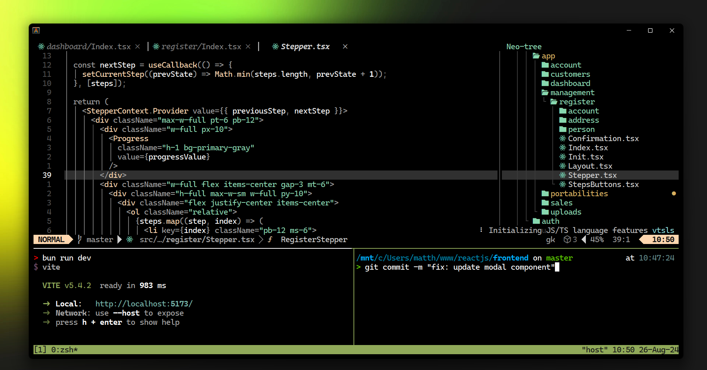

# 💤 LazyVim by ⚡️*blackadm*
### 🚀 Meu template para desenvolvimento utilizando [LazyVim](https://www.lazyvim.org/).

<div>
  
</div>

## ⚙️ Dependências
- Primeiro passo, você deve possuir o [Neovim](https://neovim.io/) na última versão instalado. Após isso, instale o [LazyVim](https://www.lazyvim.org/installation).
- Baixe e instale a fonte da sua preferência no [NerdFonts](https://www.nerdfonts.com/font-downloads).

## 💡 Instalar minhas configurações
### Importante, faça o backup dos arquivos atuais do Neovim : 
- Linux / MacOS 
```
  mv ~/.config/nvim ~/.config/nvim.bak
  mv ~/.local/share/nvim ~/.local/share/nvim.bak
```
- Windows 
```
  mv $env:LOCALAPPDATA\nvim $env:LOCALAPPDATA\nvim.bak
  mv $env:LOCALAPPDATA\nvim-data $env:LOCALAPPDATA\nvim-data.bak
```
### Clone o repositório e instale as configurações
- Linux / MacOS 
```
  git clone https://github.com/black-adm/my-lazyvim-config ~/.config/nvim
```
- Windows 
```
  git clone https://github.com/black-adm/my-lazyvim-config $env:LOCALAPPDATA\nvim
```